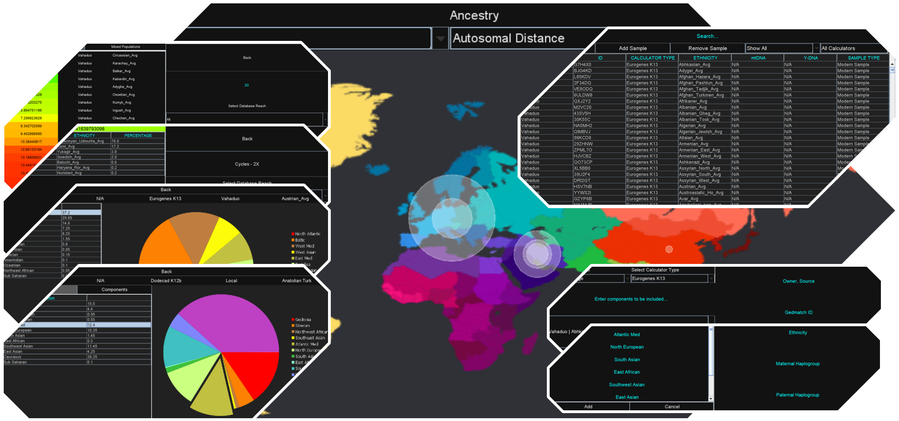

# Ancestry-Tool
Ancestry Tool is a Java window-based application created using [Swing](https://en.wikipedia.org/wiki/Swing_(Java)) framework.

The tool aims at making use of publicly available ancestry project calculator's datasheets similar to the likes of 
[Vahaduo](http://vahaduo.genetics.ovh/) and [Gedmatch](https://www.gedmatch.com/). It makes use of 3 ancestry sample types
(modern, ancient and average) based on 4 Gedmatch calculators (Eurogenes K13, Dodecad K12b, MDLP World, Ancient Eurasia K6).

The goal is achieved by implementing a local database interface, individual sample windows as well as distance, mixed distance 
and single calculators ([engine](src/engine)) to be used for sample composition comparisons. 
The UI consists of light and dark mode layouts.

<p>
  </img>
</p>


## Prerequisites
[Java version 15.0.1](https://www.oracle.com/java/technologies/javase/jdk15-archive-downloads.html) along with
[JFreeChart](https://www.jfree.org/jfreechart/) library was used in development.


## Installation
The project mainly utilizes in-built Java package [Swing](https://en.wikipedia.org/wiki/Swing_(Java)) for 
the GUI; however, additional jcommon 1.0.23 and jfreechart 1.10.19 jar files of [JFreeChart](https://www.jfree.org/jfreechart/download.html) 
should be installed if the program is to be run from the source code.

When run from the jar file, no additional installations are required.


## Getting Started
The program can be accessed by downloading, unzipping [Ancestry-Tool.zip](Ancestry-Tool.zip) and running the **Ancestry Tool App**

Below directory should be ensured when running the jar application:

```
+-- database
|   +-- database.ser
+-- Ancestry Tool App
```

[Demo](demo/demo.mp4) video can be viewed for program features and their use.

## Database
Project [database](database) is serialised file containing added samples. It is accessed upon program launch (loading database) 
and exit (saving changes). The local database can only be altered through the app interface; however, the serialised database 
file can be changed provided the given directory structure is followed.

Pre-built database is provided in the repository as folder and in [Ancestry-Tool.zip](Ancestry-Tool.zip) containing 1000+ 
publicly available samples.


## Details
- Author - Arastun Mammadli
- License - [MIT](LICENSE)
